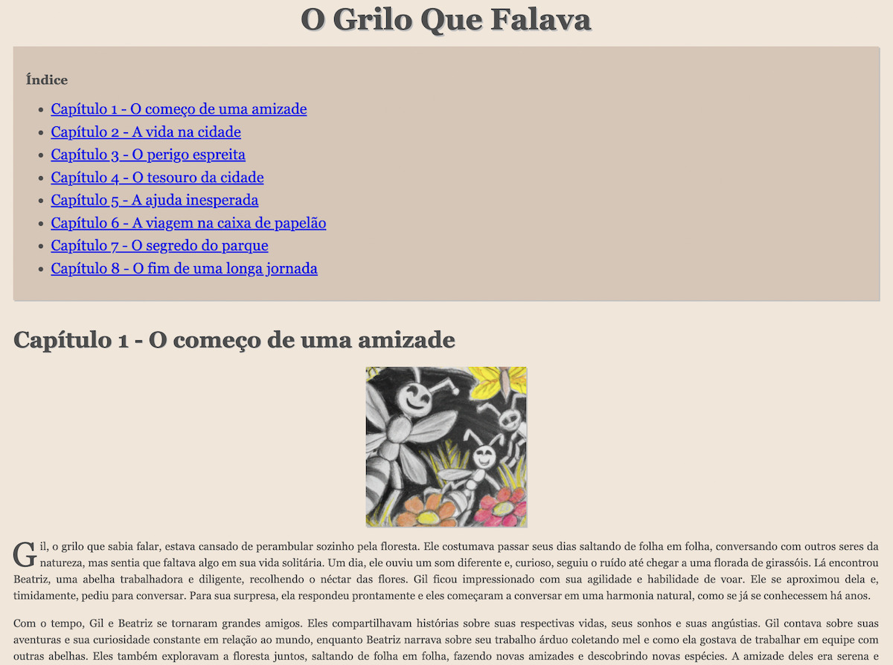

# Descrição do projeto
Este é um projeto estudo que consiste em uma aplicação em JavaScript que utiliza a API da OpenAI para gerar conteúdo escrito automaticamente para livros. Através da API, é possível gerar trechos de texto de forma automática, com base em um modelo pré-treinado de linguagem natural. O objetivo do projeto é auxiliar na elaboração de livros de forma mais rápida e eficiente, a partir da geração de conteúdo escrito de qualidade.

# Como utilizar
Para utilizar a aplicação, é necessário ter uma conta na OpenAI e uma chave de acesso à API.  É preciso que a chave de acesso esta disponível através da variável de ambiente `OPENAI_API_KEY`. Após inserir a chave de acesso, é possível rodar a aplicação através do comando `node index.js`, que irá gerar um trecho de texto automaticamente. O trecho gerado pode ser utilizado como base para a elaboração de um livro, por exemplo.

    ./index.js [options] título do livro

    O título do livro é um parâmetro obrigatório. Ele será usado para criar um diretório de mesmo nome contendo o projeto e o resultado. 

    Existem 2 modos de utilização:
    1) O modo manual, que é padrão, e é executado em 3 etapa: 
        1.1) Gera o livro.conf: Onde fica as definições dos personagens, roteiro e tamanho dos capítulos.
        1.2) Gera o esboço do livro, separado por capítulos, e que deve ser avaliado e ajustado.
        1.3) Processa os capitulos, baseando-se no esboço produzindo o livro como resultado final.
    2) O modo totalmente automatizado, chamado de resumo, que pode ser acionado com a opção: --resumo

    Modo Manual:
    Ao rodar a primeira vez, será criado o diretório do projeto com arquivo de configuração livro.conf contendo os parâmetros exigidos para gerar o livro. Após modificar o livro.conf, rode uma segunda vez para criar o esboço do livro, valide, modifique se necessário for, e rode o comando mais um vez para, em fim, produzir o livro completo.

    Modo Resumo:
    Passe uma a descrição do livro desejado para a opção --resumo e um livro completo será gerado.

    Todas as execuções subsequentes gerarão um novo livro sobrescrevendo a anterior.

    options:
    --novo-esboco   
        cria um novo esboço sobrescrevendo o anterior
    --resumo 'todo o texto do reusmo deve estar entre aspas' 
        cria um livro completo do resumo em um único passo

# Recursos utilizados
- Node.js + NPM
- API da OpenAI
- Linux: imagemagick e curl

## Link para alguns exemplos

https://livros.rodrigolop.es/

  .