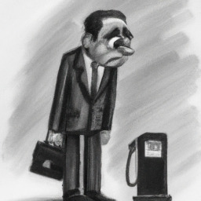
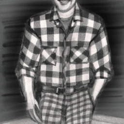
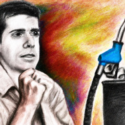

# A Viagem de Choquito

### Índice

* [Capítulo 1 - O sonho de Choquito](#capitulo1)
* [Capítulo 2 - A ameaça de Prestígio](#capitulo2)
* [Capítulo 3 - A decisão de Choquito](#capitulo3)

## Capítulo 1 - O sonho de Choquito

 

Choquito era um boneco peculiar. Com seus olhos grandes e boca sempre aberta, ele transmitia uma alegria contagiante que conquistava a todos que o viam. Ele trabalhava em um pequeno posto de gasolina no interior, onde abastecia os carros e vendia bebidas e salgadinhos. Apesar de amar seu trabalho, ele sonhava em ser o boneco mais importante da cidade. Imaginava que, se isso acontecesse, seria admirado e amado por todos, trazendo a ele uma grande satisfação pessoal.

Ele era muito detalhista com sua aparência física e com suas tarefas no trabalho. Todo dia, ele se levantava cedo, se arrumava com seu uniforme azul e vermelho, colocava seu crachá de identificação e pegava sua vassoura e pá para limpar o posto antes dos clientes chegarem. Quando chegavam, Choquito recebia todos com sorrisos e piadas, tentando tornar a visita o mais agradável possível. Com o passar do tempo, ele percebia que seu esforço não era reconhecido pelo público. O posto que trabalhava estava sempre vazio, enquanto o posto concorrente do outro lado da rua atraía todos os clientes. E assim, Choquito percebia que seus sonhos pareciam cada vez mais distantes.

## Capítulo 2 - A ameaça de Prestígio

 

Choquito trabalhava feliz e contente em seu posto de gasolina. Recebia os clientes com seu uniforme azul e vermelho e fazia questão de que todos fossem bem atendidos. Ninguém jamais imaginaria que seu local de trabalho estava prestes a falir. Foi então que Prestígio, seu rival, começou a fazer intrigas e espalhar boatos sobre Choquito. O boneco sem graça e arrogante não suportava a popularidade e a simpatia do concorrente. Começou a convencer os clientes a não abastecerem no posto de Choquito e foi plantando a semente da discórdia entre os frequentadores da região. Assim, poucos dias depois, Choquito percebeu que seu sonho estava prestes a desmoronar.

## Capítulo 3 - A decisão de Choquito

 

No capítulo final da história de Choquito, o boneco enfrenta o dilema de perder o emprego e o sonho de ser o boneco mais popular da região. Com o posto completamente vazio e sem nenhuma esperança de melhora, ele se vê diante de uma difícil decisão. No entanto, com a ajuda de alguns amigos e muita criatividade, Choquito decide transformar o posto em um local de entretenimento. E é assim que o posto passa a ser um ponto turístico da cidade, com atrações que vão além do abastecimento de combustível.

Com o objetivo de atrair os clientes de volta, Choquito e seus amigos criam uma série de atividades, como festas temáticas, apresentações de músicos e contadores de histórias, além de uma pequena cafeteria com quitutes deliciosos. A ideia dá tão certo que logo o posto vira um local de encontro para a população da cidade e arredores. O sucesso é tanto que Choquito não só salva o posto de gasolina da falência, como também realiza seu sonho de ser o boneco mais adorado da região, agora conhecido por criar um espaço que promove o bem-estar e a diversão para todos.