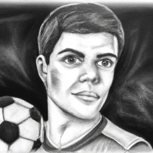
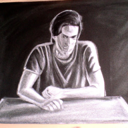
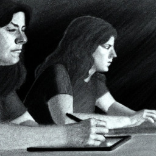
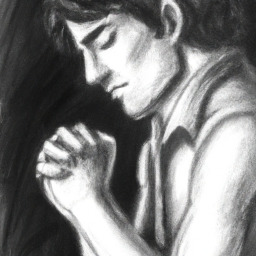
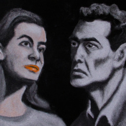
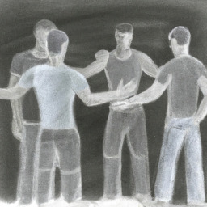
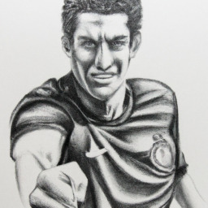
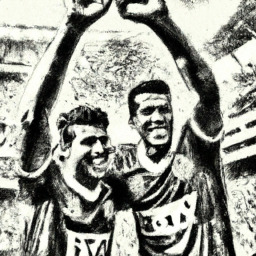

# Uma partida de futebol

### Índice

* [Capítulo 1 - A cidade dos sonhos](#capitulo1)
* [Capítulo 2 - O encontro](#capitulo2)
* [Capítulo 3 - As estratégias](#capitulo3)
* [Capítulo 4 - A treinadora](#capitulo4)
* [Capítulo 5 - O embate](#capitulo5)
* [Capítulo 6 - A decisão](#capitulo6)
* [Capítulo 7 - O jogo final](#capitulo7)
* [Capítulo 8 - A cidade em paz](#capitulo8)

## Capítulo 1 - A cidade dos sonhos

 

Rafael nasceu em uma pequena cidade onde o futebol era o centro das atenções. Desde que aprendeu a dar os primeiros chutes, sonhava em representar as cores do time da casa e fazer história em campo. Era um rapaz de estatura mediana, mas ágil e veloz como poucos. Não havia obstáculo que o impedisse de ir atrás de seus objetivos, especialmente quando o assunto era o futebol.

Rafael cresceu assistindo a jogos no campo e se encantava com as manobras dos jogadores. Quando sua mãe o chamava para casa, ele pedia por mais alguns minutos para que pudesse assistir ao menos uma parte do jogo. Aos poucos, foi aprendendo as jogadas mais complexas e treinando incansavelmente para desenvolver sua habilidade no esporte.

Com o tempo, Rafael foi chamando a atenção de treinadores locais e acabou sendo incorporado às categorias de base do time da cidade. Era a chance que ele tanto esperava para se destacar e mostrar para todos o que era capaz de fazer. Rafael tinha um objetivo claro: ser jogador profissional e defender as cores do time da casa nas principais competições do país.

Ele se dedicou ao máximo aos treinos e jogos da equipe, sempre buscando aprimorar suas habilidades e se tornar o melhor jogador do time. Era uma tarefa difícil, embora soubesse que o caminho até o topo poderia ser árduo. Mas Rafael não se intimidava: sua determinação e vontade de vencer eram maiores que qualquer obstáculo que pudesse encontrar.

Com o passar dos anos, Rafael foi crescendo e evoluindo como jogador. Seus treinadores o elogiavam pela sua determinação em campo e pela velocidade com que conseguia conduzir a bola no meio de campo. Ele tinha o coração acelerado cada vez que colocava a bola para dentro do gol adversário; era uma sensação de felicidade incrível, que o fazia perceber que cada lance valia a pena.

E foi assim que Rafael descobriu o que seria o maior desafio de sua vida: encerrar uma partida que parecia nunca acabar. Um jogo histórico, interrompido no meio do segundo tempo, que ficou inconcluso por anos e anos. Era o sonho de toda a cidade ver essa partida chegar ao fim, para que finalmente pudessem viver em paz. E Rafael estava determinado a fazer parte dessa história.

## Capítulo 2 - O encontro

 

Rafael estava nervoso enquanto caminhava até a casa de Pedro, o presidente do clube. Ele sabia que tinha uma ideia que poderia ajudar a cidade inteira e a equipe que tanto amava, mas precisava convencer Pedro do mesmo. Ao chegar na casa do presidente, foi recebido com um sorriso caloroso e um abraço amigável. Eles seguiram para uma sala de estar aconchegante onde se sentaram para conversar.

Pedro perguntou a Rafael por que ele estava tão agitado. Ele disse que tinha uma ideia para encerrar a partida que parecia não ter fim e Pedro ficou curioso. Rafael começou a explicar detalhadamente sua estratégia e como ela poderia ser intensa, mas conquistar a vitória para a equipe da cidade. Pedro percebeu a paixão nos olhos de Rafael e admirou sua determinação.

Os dois começaram a trabalhar juntos para aprimorar a estratégia e descobrir como podiam executá-la. Eles ficaram acordados por várias noites planejando cada detalhe e pensando em como poderiam convencer o resto do clube a apoiá-los. Rafael estava empolgado por ter encontrado alguém que também acreditava nessa ideia e ofereceu todo o seu tempo para torná-la realidade.

Após muitas reuniões e discussões, Pedro e Rafael finalmente desenvolveram um plano que poderia funcionar. Eles analisaram o campo de jogo e as habilidades dos jogadores dos dois times. Eles identificaram os pontos fortes e fracos de cada equipe e pensaram em como poderiam usar isso a seu favor. Eles também desenvolveram um plano para manter a calma e lidar com a pressão do jogo.

Pedro sabia que Rafael era vital para o sucesso da estratégia. Ele pediu ao jovem jogador que treinasse ainda mais para melhorar suas habilidades e desempenho no campo de jogo. Rafael se dedicou intensamente aos treinos, trabalhando tanto sua habilidade com a bola quanto sua resistência e velocidade. Ele queria ter certeza de que seria capaz de desempenhar seu papel perfeitamente no dia do jogo.

Enquanto trabalhava na estratégia, Pedro apresentou Rafael a outras figuras importantes do clube e da cidade. Eles eram polarizados na ideia de encerrar o jogo, mas Rafael conseguiu mostrar-lhes o quão importante era para os interesses de todos na cidade. Eles se juntaram à causa e ajudaram Pedro e Rafael a fazer essa ideia acontecer.

No final, Pedro e Rafael conseguiram convencer a maioria dos membros do clube de que encerrar a partida era a opção certa para a cidade e para a equipe da casa. Eles apresentaram várias ideias e conseguiram encontrar pontos em comum que agradassem a todos. Pedro sabia que seria difícil, mas acreditava que a união e determinação de todos fariam essa ideia se tornar realidade.

O capítulo termina com Pedro e Rafael com uma sensação de realização e esperança. Eles começaram a trabalhar juntos em um projeto que não só poderia beneficiar a equipe do clube, mas a cidade inteira. Eles tinham muitas barreiras para superar, mas sabiam que juntos poderiam alcançar o objetivo desejado. Rafael finalmente encontrou alguém em quem confiar e Pedro sabia que tinha encontrado um aliado valioso.

## Capítulo 3 - As estratégias

 

Na terceira parte da história, Pedro e Rafael passaram várias noites desenvolvendo estratégias para apresentar ao clube. Eles estavam convencidos de que o encerramento da partida interminável era a melhor opção para a cidade, mas sabiam que precisavam convencer todos os membros do clube. O desafio era grande, mas eles estavam determinados a conseguir.

Pedro era um presidente dedicado e comprometido com o clube. Ele sabia que o encerramento da partida era fundamental para o crescimento da equipe e da cidade, mas também sabia que seria preciso apresentar argumentos bastante convincentes aos demais membros do clube. Rafael, por sua vez, era um jogador talentoso e experiente, que sabia tudo sobre a cidade e sobre o clube. Ele já havia idealizado um planejamento detalhado de como seria o encerramento da partida, mas precisava convencer os demais membros do clube sobre a ideia.

As primeiras noites de planejamento foram difíceis e cansativas. Pedro e Rafael passavam horas discutindo e debatendo ideias, sempre pensando em maneiras de persuadir os demais membros do clube. Eles sabiam que seria preciso fazer uma apresentação persuasiva e com argumentos equilibrados, apresentando os prós e contras do encerramento da partida.

Pedro e Rafael sabiam que para convencer os membros do clube seria preciso apresentar um projeto sólido e bem pensado, que mostrasse não apenas as vantagens do encerramento da partida, mas também como essa mudança afetaria o clube como um todo. Para isso, eles decidiram dividir o projeto em etapas, mostrando o passo a passo que seria necessário para realizar essa mudança.

Eles decidiram que a primeira etapa seria a apresentação do projeto para os membros do clube, com argumentos para convencer os mais indecisos. Em seguida, seria necessário fazer uma pesquisa com os torcedores para saber a opinião deles sobre o encerramento da partida. Depois disso, o próximo passo seria criar um plano de ação, com todas as etapas necessárias para o encerramento da partida.

Pedro e Rafael trabalhavam em uníssono, e enquanto Rafael fazia a pesquisa de opinião com a torcida, Pedro buscava conversar com líderes políticos e empresários locais a fim de conseguir apoio e recursos para o projeto. Também montaram um grupo de trabalho dentro do clube para acelerar e concluir as próximas etapas do projeto.

Ao final da terceira semana de trabalho, Pedro e Rafael conseguiram reunir todos os dados necessários para lançar o projeto. Em uma noite de reunião com os membros do clube, Pedro e Rafael apresentaram de forma convincente a proposta para encerrar a partida e como isso ajudaria o clube e a cidade. Após algumas dúvidas e discussões, a maioria dos membros acabou aderindo ao projeto.

Foi uma grande vitória para Pedro e Rafael, mas eles já sabiam que as próximas etapas seriam ainda mais difíceis. Mesmo assim, sabiam que estavam no caminho certo e estavam dispostos a lutar até o fim pelo encerramento da partida.

## Capítulo 4 - A treinadora

 

Rafael, o físico e ágil jogador do time da casa, estava determinado a encerrar a partida que nunca terminou em sua cidade. No entanto, para que isso acontecesse, ele precisava conversar com Maria, a treinadora do time visitante. Maria não se conformava com a proposta de encerrar a partida e estava disposta a fazer de tudo para que ela continuasse em andamento. Rafael sabia que precisava conversar com a treinadora para tentar encontrar uma solução que agradasse a todos.

Com essa missão em mente, Rafael marcou uma reunião com Maria em um restaurante da cidade. O ambiente era aconchegante, com luzes amareladas e uma música suave ao fundo. Rafael chegou com uma certa tensão, pois sabia que essa conversa seria decisiva para o encerramento da partida. Maria, por sua vez, estava com um semblante fechado quando o encontrou. Marcou presença com sua personalidade forte e determinada.

Os dois se cumprimentaram e sentaram em uma mesa próxima ao balcão. A conversa começou de forma tensa, com Maria questionando as intenções de Rafael em encerrar a partida. Ela não conseguia ver as coisas do ponto de vista do jogador e só se importava com o sucesso do seu time. Rafael, por sua vez, usou de toda a sua habilidade em convencer Maria de que encerrar a partida era a melhor saída.

Rafael apresentou argumentos sólidos que mostravam que encerrar a partida seria um benefício para todos. Ele usou sua habilidade no futebol para mostrar para Maria que era possível encontrar uma solução que beneficiasse a todos envolvidos. Maria relutava em aceitar a proposta, porém Rafael usava de tanto conhecimento tático que ela tinha que prestar atenção. 

A conversa se estendeu por horas a fio, mas no final Rafael e Maria pareciam ter chegado a um acordo. A treinadora do time visitante percebeu que encerrar a partida seria a melhor solução e Rafael a convenceu que ele poderia garantir um jogo justo e emocionante. Eles se despediram com um aperto de mãos e um sorriso no rosto, sabendo que essa conversa foi fundamental para o encerramento da partida.

Rafael deixou o restaurante com uma sensação de alívio, sabendo que havia cumprido sua missão. Ele agora estava seguro de que poderia contar com Maria na realização desse sonho. A cidade inteira esperava pelo encerramento da partida e Rafael sabia que ele e Pedro estavam mais próximos do objetivo final. 

No entanto, Maria saiu com um peso no coração. Ela sabia que o encerramento da partida era importante para a cidade e para o time da casa. Mas ela também sabia que essa partida significava muito para o time visitante, tanto quanto para o povo que o apoiava. Ela sabia que a missão não seria fácil, mas que precisaria tentar encontrar um equilíbrio para que nenhuma equipe saísse prejudicada. 

Maria sabia que o próximo passo seria apresentar a ideia para a diretoria do seu time, e essa seria uma tarefa ainda mais difícil. Ela precisaria convencê-los de que encerrar a partida seria a melhor coisa a ser feita. Maria sabia que essa batalha seria travada nos bastidores, nos corredores de poder. Mas ela estava disposta a lutar com toda a sua força para encontrar uma solução que agradasse a todos.

Com o coração apertado, Maria seguiu o seu caminho, sabendo que a batalha estava apenas começando. Ela ainda não sabia as consequências das próximas decisões que tomaria, mas estava consciente de que precisaria ser forte e determinada. E Rafael, mesmo ainda não sabendo dos próximos passos de Maria, tinha a certeza de que ela era uma adversária formidável e que essa batalha seria extremamente dura.

## Capítulo 5 - O embate

 

Maria, a treinadora do time visitante, parecia impenetrável em sua postura. Ela se mantinha firme em sua posição de que o jogo nunca terminado deveria continuar. Rafael, por sua vez, tentava mostrar para ela que essa partida interminável estava prejudicando a cidade e ambas as equipes. O clube da casa precisava encerrar esse jogo para poder seguir em frente, e isso era fundamental para o crescimento do time.

A conversa transcorreu tensa entre os dois. Rafael sabia que precisava ser persuasivo para convencer Maria, mas ele não estava disposto a desrespeitá-la. Foi quando ele teve uma ideia inusitada. A luz do sol estaria se pondo e a noite chegando em breve, Rafael convidou a treinadora para voltarem ao estádio para conversarem sob a luz das estrelas.

Maria aceitou o convite e seguiu Rafael até o estádio. Quando chegaram, ele a levou para o centro do campo e pediu para que ela sentisse a tranquilidade e a paz que o lugar transmite à noite. Até a brisa parecia mais calma naquele lugar. Rafael explicou que o estádio era um ambiente que inspirava a união entre equipes e que encerrar a partida nunca terminada seria um passo importante para unir as duas cidades através do futebol.

Maria ouvia tudo com atenção, mas ainda resistia em aceitar a proposta de Rafael. Foi então que ele decidiu jogar uma partida com Maria. Ele propôs um jogo em que os dois poderiam ser jogadores em igualdade de condições, ambos teriam a oportunidade de marcar gol e se defender. Maria aceitou a proposta relutantemente.

A partida começou e Rafael mostrou que era um craque no futebol. Dividia bem, driblava como poucos, protegia a bola com habilidade e chutava forte com precisão. Maria, por sua vez, mostrava muita determinação e respeito pelo adversário, mas tinha dificuldades em acompanhar o ritmo de jogo. Rafael foi marcando um gol atrás do outro e Maria se viu em desvantagem, mas persistindo em continuar jogando. O jogo foi emocionante, mas Rafael acabou vencendo.

Depois da partida, Rafael se aproximou de Maria e agradeceu a ela pela partida divertida. Ele explicou que o respeito pelo adversário era fundamental para o sucesso de um time e que, assim como naquela partida em que eles jogaram juntos, o encerramento da partida nunca terminada poderia unir ainda mais as duas cidades. Maria finalmente se convenceu e decidiu apoiar a proposta de Rafael.

## Capítulo 6 - A decisão

 

A tensão estava no ar quando Pedro e Rafael apresentaram as estratégias para encerrar a partida que nunca havia terminado. Os membros do clube estavam divididos entre os que queriam encerrar a partida e os que não queriam. Alguns acreditavam que o jogo deveria continuar até que houvesse um vencedor claro, enquanto outros estavam exaustos da partida que parecia nunca acabar e queriam encerrar a partida a qualquer custo.

Os argumentos apresentados por Pedro e Rafael eram fortes, mas a resistência dos membros do clube era grande. Eles temiam que o encerramento da partida pudesse gerar um sério conflito com o time visitante, que tinha a seu favor o fato de ainda estar em vantagem no placar. 

Mesmo diante dessa situação complicada, Pedro e Rafael se mantiveram firmes em suas convicções. Eles sabiam que o encerramento da partida era fundamental para a cidade e para o clube, e não desistiriam sem lutar até o fim. Então, com habilidade, foram persuadindo cada membro do clube, escutando e apresentando seus argumentos com cuidado e respeito.

A conversa ia longa e pareceu que não haveria nenhum consenso a respeito. Porém, em determinado momento, um dos membros lembrou-se do filho, que assim como ele, viajava com frequência a outras cidades, e quase nunca tinha a chance de acompanhar as partidas do clube. Ele se deu conta de que, se a partida não fosse encerrada, seu filho também não teria a oportunidade de assistir ao clube local em campo. Aquilo foi o pontapé inicial para uma mudança nas perspectivas dos membros.

Pedro e Rafael aproveitaram essa oportunidade e tornaram o argumento do membro em uma ferramenta para convencer a maioria. Eles ressaltaram que o clube não era só dos membros do clube, mas sim da cidade e de todos os seus habitantes, independente de sua relação com o clube local. Todos mereciam a oportunidade de encerrar a partida interminável e dar um fechamento para aquele episódio.

Com a negociação se afunilando e a possibilidade do encerramento cada vez mais real, um dos membros mais resistentes levantou-se e declarou seu voto a favor do encerramento da partida. Foi seguido por mais um e logo por mais outro, até que a votação chegou ao final e a decisão mais conciliatória e estratégica foi alcançada.

Pedro e Rafael sorriram um para o outro agradecidos, sabiam que havia sido um longo caminho e que o ciclo se encerraria de maneira positiva para todos. Agora era hora de unir forças para encerrar a partida e fazer história, para o bem de toda a cidade.

## Capítulo 7 - O jogo final

 

O dia do encerramento da partida interminável finalmente havia chegado. O estádio estava lotado, a torcida fazia um barulho ensurdecedor. O campo estava perfeito e as equipes entraram em campo para disputar a tão aguardada partida. Rafael, que havia se tornado um grande amigo da treinadora do time visitante, Maria, pôde sentir o clima tenso no ar. Ele sabia que essa partida poderia mudar o futuro da cidade para sempre. 

O jogo começou com muita intensidade e as equipes se se revezavam no ataque e na defesa. Rafael observava que Maria tinha estudado bem o time da casa e estava fazendo de tudo para surpreender a defesa adversária. Enquanto isso, Pedro, que assistia ao jogo das arquibancadas, vibrava a cada jogada do time local.

Rafael percebeu que o time da casa estava com dificuldades na criação das jogadas e decidiu entrar em campo para ajudá-los. Sua habilidade e visão de jogo eram admiradas por todos, e logo ele começou a criar novas oportunidades de gol. A torcida comemorava a cada passe certo e a cada chute a gol. 

Enquanto isso, Maria se mantinha focada e determinada a mudar o rumo da partida. Ela tinha uma estratégia muito bem definida e sabia que seria necessário trabalhar duro para alcançar o objetivo. Ela não deixava brechas para o time adversário e fazia de tudo para neutralizar as jogadas do time da casa. 

O clima no estádio estava eletrizante, com muitos cânticos e gritos vindos das arquibancadas. Pedro, em meio a todos aqueles torcedores, se emocionava a cada jogada. Ele sabia que estava muito próximo de realizar seu sonho e encerrar a partida interminável. 

A partida continuava acirrada, com ambas as equipes demonstrando muita garra e determinação em campo. Rafael e Maria se envolveram em um duelo à parte, mostrando que o futebol poderia estar acima de tudo. A cada jogada, eles demonstravam respeito e amizade um pelo outro. 

Faltando poucos minutos para o final da partida, Rafael teve uma grande oportunidade de marcar o gol que encerraria a partida interminável. Ele avançou pelo campo e chutou forte para o gol, mas acabou esbarrando na defesa adversária. A torcida se calou por um instante, mas logo voltou a cantar ainda mais alto, apoiando o time da casa. 

O relógio marcava quase noventa minutos de jogo, quando o árbitro apitou pela última vez. O jogo havia terminado, e o resultado era favorável ao time da casa, que saiu vencedor por 1 a 0\. A torcida foi ao delírio, em êxtase com aquele resultado histórico. 

Pedro e Rafael entraram em campo para comemorar com o time e agradecer todos os envolvidos na realização desse sonho. Maria se juntou a eles, e juntos demonstraram como o futebol poderia unir pessoas e mudar destinos. A cidade podia finalmente viver em paz e celebrar a união entre os dois times rivais.

## Capítulo 8 - A cidade em paz

 

A cidade inteira estava em festa após o encerramento da partida jamais acabada. O estádio estava lotado, as pessoas animadas e radiantes com o desfecho histórico do jogo que marcou a cidade. Os torcedores das duas equipes, antes rivais, agora se cumprimentavam e comemoravam juntos. A cidade estava em paz, finalmente. 

No campo, Pedro e Rafael foram chamados ao centro do gramado para receberem as homenagens da torcida e do clube. A multidão aplaudiu de pé os dois homens que foram determinantes para que o encerramento da partida acontecesse. Pedro levantou um troféu simbólico que havia preparado como uma forma de agradecimento e de celebração. 

Rafael, por sua vez, pegou o microfone e agradeceu a todos aqueles que contribuíram para que aquele momento fosse possível. Ele destacou a importância da união dos dois times em busca de um objetivo maior: o encerramento do jogo e a paz entre as torcidas. A emoção tomou conta do estádio quando ele citou que agora a cidade estava pronta para escrever uma nova história.

Após seu discurso, Rafael entregou o microfone para Pedro, que anunciou a criação de um memorial em homenagem àquela partida jamais acabada. O memorial seria um espaço para que as pessoas pudessem conhecer a história do jogo, suas peculiaridades, curiosidades e também para que se lembrassem da importância da união e do esporte na construção de uma cidade melhor.

O público aplaudiu com entusiasmo a ideia do memorial e já começou a imaginar como seria o espaço. Pedro e Rafael se abraçaram em frente às câmeras e a torcida, reafirmando seu compromisso de trabalhar unidos para fazer da cidade um lugar ainda melhor para se viver.

Após a cerimônia, a cidade seguiu em celebração. Os bares, restaurantes e casas noturnas estavam lotados. As pessoas dançavam na rua, cantavam e celebravam a união e o sentimento de paz que tomou conta da cidade. Os pais levavam seus filhos para conhecer o memorial e contar a história daquela partida uma vez jamais acabada. 

Na manhã seguinte, a cidade acordou com um novo sentido. As pessoas caminhavam na rua com um sorriso no rosto e já se podia ouvir as conversas sobre um futuro melhor para a cidade. As lojas ao longo da rua principal estavam decoradas com as cores dos dois times e os comércios vendiam produtos com o tema do clube da casa.

Assim, a cidade seguiu em frente, mais unida do que nunca. A prova de que a vontade de trabalhar em equipe pode superar qualquer rivalidade e manifestação de ódio, e que a vivência no esporte pode ensinar lições de união, compaixão e colaboração, deixando em uma única partida um legado incalculável para o futuro da cidade.